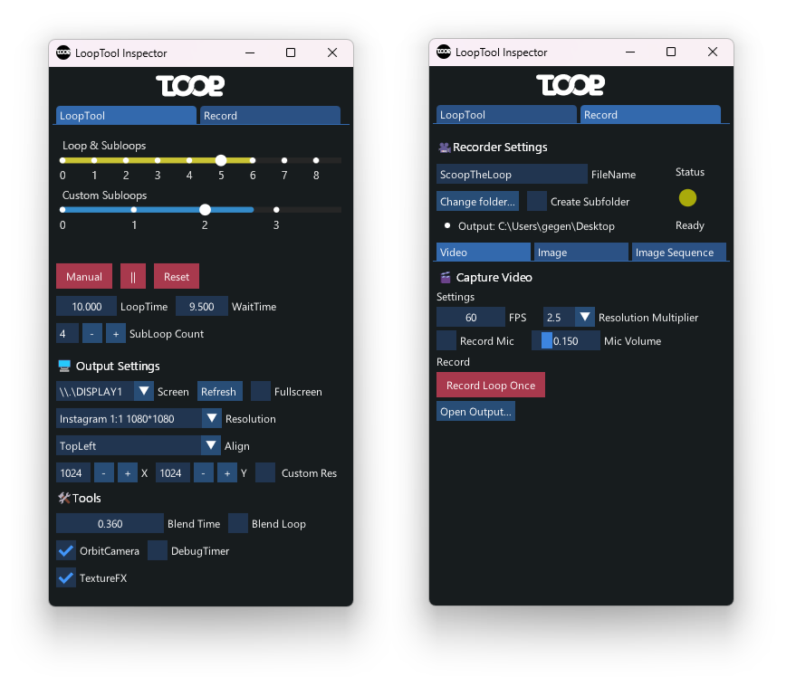

<p align="left">
 
</p> 

 
# VL.LoopTool 
A small toolset to create video loops and record them in VVVV Gamma


## Installation

- Currently tested with vvvv gamma above 5.2. Get it [here](https://visualprogramming.net/)
- Open the nuget commandline inside VVVV via Quadmenu  > Manage nugets  > Commandline and enter:

```
nuget install vl.looptool -pre
```

## Features

<p align="left">
 
</p> 

- Globally available playback LFO phase, as single loop, subloops and custom subloops. 
- Animation and blending nodeset based on Loop and subloop phase, tweening and random interations.
- Control playback manually via UI
- Capture your repeating animations as videos, image sequeneces or single images.
- Stackable TextureFX Interface allowing access to Scene color and depth.
- Presets! animated cameras, backgrounds and lighting and postFX presets.

## 🚨🚨 Disclaimer 🚨🚨 

Looptool is my personal attempt to make my own creative process as easy and fun as possible. 
At this stage of development im still trying to define and create the toolset that fits this purpose.
Breaking changes will be very common for the animation node set. I will do my best to keep the recording as consistent as i can.

## Contributing

Help contributions and suggestions are very welcome. Consider creating an issue here or create a post on the vvvv forum. [vvvv forum](http://www.discourse.vvvv.org).

## Dependencies

- [VL.ScreenRecorder](https://github.com/vvvv/VL.ScreenRecorder)
- [VL.Addons](https://github.com/bj-rn/VL.Addons)
- [VL.AlchemX](https://github.com/KairosResearchLab/Kairos)


[](https://visualprogramming.net/)